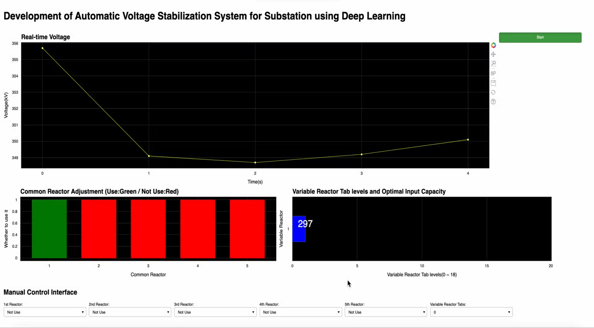

# AVSS for Substation
This is a Python implementation of the paper "***Automatic Voltage Stabilization System for Substation using Deep Learning***"<br>

[doi](https://doi.org/10.2298/CSIS220509050M)

## Abstract
The operating voltage in the substation must be maintained at its rated voltage within the specified standard because a voltage outside the specified range may cause a malfunction of the power facility and interfere with the stable power supply. Therefore, the voltage regulation process to maintain the rated voltage of the substation is essential for the stability of the power system. However, the voltage regulation process is currently performed manually by resident staff. Voltage regulation based on human judgment increases the uncertainty of voltage stabilization and makes efficient operation in consideration of the economic feasibility of power facilities difficult. Therefore, this paper proposes an automatic voltage stabilization system that can automatically perform voltage regulation. Instead of predicting the electrical load or overvoltage conditions studied so far, we focus on more direct, scalable input capacity prediction for an automatic voltage stabilization system. First, the proposed system predicts the input capacity required for a given situation through a trained stacked LSTM model. Second, an optimal regulation plan is derived through an optimization process that considers the economic feasibility of power facility operation. Additionally, the development of the user interface makes it possible to visualize the operation of algorithms and effectively communicate the models’ predictions to the user. Experimental results based on real substation data show that the proposed system can effectively automate the voltage regulation process.

<p align="center">
    
</p>

<p align="center">
    
</p>

## Dependencies
- Python 3.8
- pandas 1.4.1
- numpy 1.21.5
- bokeh 2.4.2
- tensorflow 2.6.0

## Usage
Command line for running the UI window: 
```bash
bokeh serve --show main.py
```

If you want to run the toy example, use the command line below.
In the toy example, you can see more dynamic changes by using random integer values as input capacity instead of model prediction:
```bash
bokeh serve --show toy.py
```

## References
Original project repository: [CSID-DGU/2021-2-CSC4031-SYNERGY](https://github.com/CSID-DGU/2021-2-CSC4031-SYNERGY)

## Citation
If you use this for research, please cite. Here is an example BibTeX entry:

```
@article{moon2023automatic,
  title={Automatic voltage stabilization system for substation using deep learning},
  author={Moon, Jiyong and Son, Minyeong and Oh, Byeongchan and Jin, Jeongpil and Shin, Younsoon},
  journal={Computer Science and Information Systems},
  number={00},
  pages={50--50},
  year={2023}
}
```
```
@inproceedings{moon2022development,
  title={Development of Automatic Voltage Stabilization System for Substation Using Deep Learning},
  author={Moon, Jiyong and Son, Minyeong and Oh, Byeongchan and Jin, Jeongpil and Kim, Kwangil and Shin, Younsoon},
  booktitle={International Conference on Innovative Computing},
  pages={133--134},
  year={2022},
  organization={Springer}
}
```

## Contact
If you have any questions about codes, please contact us by asdwldyd123@gmail.com.